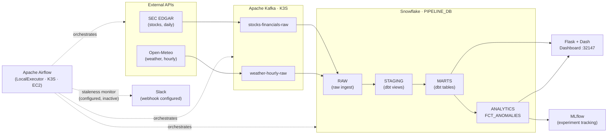

# data_pipeline

> **Live Dashboard: [http://52.70.211.1:32147/dashboard/](http://52.70.211.1:32147/dashboard/)**
> The pipeline is running live — click to see it.

---

This is a data pipeline that runs continuously on AWS, pulling real financial filings and weather data, processing them through a streaming architecture, and surfacing the results on a live interactive dashboard — all for about $70 a month.

The pipeline collects two data streams: official SEC financial filings for AAPL, MSFT, and GOOGL (updated daily) and hourly weather data from Open-Meteo. Each stream flows through Apache Kafka into Snowflake, where dbt transforms the raw data into clean, tested tables. A machine learning model (IsolationForest) scores each company's year-over-year financial trends and flags anomalies — with every model run tracked in MLflow for reproducibility. Apache Airflow orchestrates everything on schedule, running on a single EC2 instance under K3S (lightweight Kubernetes). The EC2 t3.large + 100 GiB EBS gp3 + Elastic IP runs about $70–75/month; a combination of auto-suspend, query caching, and batch gating keeps Snowflake costs minimal.

The [Design Decisions](#design-decisions) section explains why each architectural choice was made.

---

## What This Demonstrates

- **[Streaming architecture](#how-everything-connects)** — Apache Kafka decouples data collection from data storage; each side can fail and restart independently
- **[Cloud data warehousing + transformation](#what-the-snowflake-layers-mean)** — Snowflake for storage, dbt for repeatable SQL transformations with built-in data quality tests
- **[ML integration with reproducibility](#key-features)** — IsolationForest anomaly detection with every run logged to MLflow so any result can be traced back to the exact model and data that produced it
- **[Production observability](#key-features)** — Slack alerting, data staleness monitoring, structured task logs that survive container restarts
- **[Cost-conscious infrastructure](#design-decisions)** — ~$70/month total; multiple deliberate choices keep Snowflake activations to a minimum

---

## What It Does

The pipeline runs as five automated jobs, each responsible for one step in the data's journey:

1. **Stock producer** (`dag_stocks.py`, daily) — Fetches official financial filings for AAPL, MSFT, and GOOGL from the SEC, then publishes the data to a Kafka message queue. To do this, it first resolves each ticker to the SEC's internal numeric ID called a CIK (e.g. Apple files under `0000320193`, not "AAPL"), then fetches XBRL financial data (a structured XML format the SEC requires companies to use in their filings — it lets code reliably extract specific line items like revenue or net income) from SEC EDGAR, cleans it, and publishes a JSON message to the `stocks-financials-raw` Kafka topic.
2. **Stock consumer** (`dag_stocks_consumer.py`, event-driven) — Receives the financial data from Kafka, loads it into the warehouse, then runs transformations and anomaly detection. Specifically: it reads the message from Kafka, writes new rows to Snowflake `RAW.COMPANY_FINANCIALS`, runs dbt to build staging views and mart tables, then runs the anomaly detector (`anomaly_detector.py`) under a separate ml-venv. The detector fits an IsolationForest model on year-over-year financial growth, writes flagged rows to `ANALYTICS.FCT_ANOMALIES`, and logs the run to MLflow.
3. **Weather producer** (`dag_weather.py`, hourly) — Pulls a rolling 7-day hourly weather forecast from Open-Meteo and publishes it to the `weather-hourly-raw` Kafka topic.
4. **Weather consumer** (`dag_weather_consumer.py`, event-driven) — Receives the weather data from Kafka, removes any duplicate rows that already exist in Snowflake, writes net-new rows to `RAW.WEATHER_HOURLY`, then runs dbt.
5. **Staleness monitor** (`dag_staleness_check.py`, every 30 min) — Checks that both pipelines ran recently and fires a Slack alert if they haven't. *Intentionally paused in production to avoid unnecessary Snowflake warehouse activations; can be re-enabled on demand.*

Flask + Dash queries Snowflake's `MARTS` schema (the dbt-built tables) and renders an interactive candlestick chart with volume bars and a stats table. A separate "Data Quality" section queries `FCT_ANOMALIES` and displays a scatter chart and detail table of flagged records.

---

## How Everything Connects

Each tool in this stack has a single job, chosen because that job mattered enough to do deliberately.

### What each tool does

| Tool | Role in this project |
|---|---|
| **Airflow** | The scheduler and orchestrator. It wakes up on a schedule, runs tasks in order, passes data between them, and triggers other DAGs. Think of it as the conductor of the pipeline. |
| **Kafka** | A message queue that sits between "fetch data" and "store data." The producer DAG drops a message into a Kafka topic (like a mailbox); the consumer DAG picks it up. This decouples the two sides — the producer doesn't need to know or care where the data ends up. |
| **Snowflake** | The cloud data warehouse. It's the permanent home for all cleaned data. Raw API data lands in the `RAW` schema; dbt-built tables live in `STAGING` and `MARTS`. |
| **dbt** | The transformation layer. It takes the raw Snowflake tables and builds clean, deduplicated, tested views and tables on top — all in versioned SQL. The consumer DAGs call dbt automatically after every load. |
| **Flask + Dash** | The web app. It queries Snowflake's mart tables and renders charts in the browser, including a "Data Quality" section that shows anomaly-flagged records. |
| **MLflow** | Experiment tracking server. Every time the anomaly detection model runs, MLflow records which parameters were used, what the results were, and stores the model artifact — so any run can be reproduced later. |
| **K3S / Kubernetes** | Runs all services (Airflow, Kafka, Flask, MLflow) as containers on EC2. If a pod crashes, Kubernetes restarts it automatically. |

### What the Snowflake layers mean

Raw data lands in Snowflake exactly as it arrived from the API. dbt shapes it in two passes — one for cleaning, one for the dashboard — without ever touching the original copy.

| Layer | What it is | Who writes it |
|---|---|---|
| **RAW** | The raw dump. Rows land here exactly as they came from Kafka/the API, unmodified. Think of it as the "never delete this" archive. | Consumer DAGs |
| **STAGING** | dbt's cleaning step. These are SQL *views* — not actual stored tables — that rename columns, cast types, and apply consistent formatting on top of RAW. Because they're views, they cost nothing extra to store; they're just saved queries that run on demand. | dbt |
| **MARTS** | The finished product. dbt materializes these as real tables the dashboard queries. They're clean, deduplicated, and ready to display. "Mart" is short for "data mart" — a focused slice of the warehouse built for one specific use case (here, the dashboard). | dbt |

`ANALYTICS.FCT_ANOMALIES` sits outside this layering — it's written directly by the anomaly detector, not produced by dbt.

---

### Data flow, step by step

The full journey from API call to visible dashboard chart involves eleven discrete steps, each validated before passing data to the next.

```
1. Airflow wakes up (daily for stocks, hourly for weather)
        ↓
2. extract() — calls the SEC EDGAR or Open-Meteo API
        ↓
3. transform() — flattens nested JSON into rows, adds audit columns
        ↓
4. publish_to_kafka() — serializes the batch as JSON and drops it
        into a Kafka topic (stocks-financials-raw or weather-hourly-raw)
        ↓
5. trigger_consumer — Airflow fires the consumer DAG
        ↓
6. consume_from_kafka() — reads the message from the Kafka topic
        ↓
7. write_to_snowflake() — loads rows into Snowflake RAW schema
        (daily batch gate skips if already wrote today; weather dedups
        against existing timestamps to avoid hourly duplicates)
        ↓
8. dbt_run — builds STAGING views + MARTS tables on top of RAW
        ↓
9. dbt_test — runs data quality checks (not_null, unique, custom)
        ↓
10. run_anomaly_detector — IsolationForest model scores each ticker's
        YoY revenue and net income growth; anomalies written to
        ANALYTICS.FCT_ANOMALIES; run logged to MLflow
        ↓
11. Flask/Dash — queries MARTS + FCT_ANOMALIES and renders the dashboard
```

### Why Kafka in the middle?

Without Kafka: if the Snowflake write fails, the API data is lost and you'd have to re-fetch.  
With Kafka: the message stays in the topic for 48 hours regardless. The consumer can retry without touching the API. The two halves are independently restartable.

---

## Architecture

Every component in the stack, and how data flows between them:



> Full diagram also at [docs/architecture/ARCHITECTURE_DIAGRAM.md](docs/architecture/ARCHITECTURE_DIAGRAM.md)

---

## Tech Stack

| Layer | Technology |
|---|---|
| Language | Python 3.12 |
| Orchestration | Apache Airflow 3.1.8 (TaskFlow API, LocalExecutor, Helm 1.20.0) |
| Streaming | Apache Kafka 4.0 (KRaft mode, plain K8s StatefulSet) |
| Data warehouse | Snowflake Standard Edition (XSMALL warehouse, auto-suspend 60s) |
| Transformations | dbt 1.8.0 + dbt-snowflake (models + tests, run by consumer DAGs) |
| Web / Dashboard | Flask 2.3.3 + Dash 2.17.1 + Plotly 5.22.0 |
| ML / Experiment tracking | MLflow 2.x + scikit-learn IsolationForest (runs under dedicated ml-venv on EC2) |
| Container runtime | containerd (via K3S) |
| Cloud | AWS EC2 t3.large, 100 GiB EBS gp3 (~$70–75/month total) |
| Stock data | SEC EDGAR XBRL API (free, no API key) — XBRL is the structured XML format the SEC requires companies to use in filings; CIK is the SEC's numeric company ID (e.g. `0000320193` for Apple) |
| Weather data | Open-Meteo API (free, no API key) |

**Generate and browse dbt documentation locally:**
```bash
cd airflow/dags/dbt
dbt docs generate && dbt docs serve
```

---

## Quick Start

The pipeline runs on EC2 in production and can be run locally for development.

**Local dev:** See [SETUP.md](SETUP.md) for full local setup.

**Production deploy:**
```bash
cp .env.deploy.example .env.deploy   # fill in AWS values
./scripts/deploy.sh                  # validates, syncs, builds, restarts
```

**Access (via SSH tunnel):**
```bash
ssh -L 30080:localhost:30080 -L 32147:localhost:32147 ec2-stock
# Airflow UI:  http://localhost:30080
# Dashboard:   http://localhost:32147/dashboard/
```

**Public dashboard (no tunnel required):**
```
http://<ELASTIC_IP>:32147/dashboard/
```
> Get your Elastic IP: `terraform output elastic_ip` (run from `terraform/`)

---

## Key Features

- **Validation gates** at every ETL stage — extract, transform, load, and serve
- **Alerting layer** — Pipeline failures and data staleness trigger automatic Slack alerts with a 60-minute cooldown so repeated alerts don't flood the channel. The staleness DAG and webhook infrastructure are fully configured; both are intentionally inactive in production (staleness DAG paused to save Snowflake costs; Slack webhook not connected to an active workspace). Activate by setting `SLACK_WEBHOOK_URL` in your K8s secrets.
- **Cost controls** — Several deliberate choices keep infrastructure costs at ~$70–75/month: a daily batch gate (writes to Snowflake once/day, not every hourly run); weather deduplication (skipping rows that already exist); Snowflake XSMALL + auto-suspend 60s; a dashboard query cache that holds Snowflake results for 1 hour so the warehouse is queried ~4–5 times/hour regardless of traffic (see [Dashboard Cache](docs/architecture/DASHBOARD_CACHE.md))
- **Vacation mode** — set `VACATION_MODE=true` to pause all pipelines without deleting DAGs
- **Rate limiting** — SEC EDGAR client uses a token-bucket limiter (8 req/sec, thread-safe)
- **Anomaly detection** — IsolationForest model scores each ticker's year-over-year revenue and net income growth; flagged rows written to `ANALYTICS.FCT_ANOMALIES` and visible in the dashboard's "Data Quality" tab
- **ML experiment tracking** — Every run of that detection model is logged to MLflow (parameters, metrics, model artifact) so any flagged anomaly can be traced back to the exact model version and data snapshot that produced it
- **PVC-backed task logs** — structured logs survive pod restarts
- **Secrets management** — credentials via K8s Secrets (prod) or `.env` files (local)

---

## Design Decisions

**Kafka: plain StatefulSet over Strimzi Operator**
On a single EC2 t3.large already running K3S, Airflow, Postgres, and Flask, every megabyte of RAM is a real cost. Strimzi — the standard Kafka operator for Kubernetes — adds ~200 MB overhead that this instance can't spare. Instead, Kafka runs as a hand-rolled Kubernetes StatefulSet using `apache/kafka:4.0.0` (KRaft mode, no ZooKeeper). The plain StatefulSet keeps Kubernetes primitives transparent and can be migrated to Strimzi without touching the Kafka client code.

**Kafka topics use hyphen-separated names**
Kafka's JMX metric layer internally converts dots and underscores to underscores, which causes naming collisions when both appear in the same cluster. Topic names use hyphens (`stocks-financials-raw`) instead of dots or underscores to avoid the issue entirely.

**dbt runs inside the consumer DAG, not on a schedule**
A separately-scheduled dbt run would spin up Snowflake's warehouse even when no new data had arrived — paying to transform nothing. Instead, each consumer DAG calls `dbt run` + `dbt test` after it writes to Snowflake. dbt only runs when there's actually new data, which avoids unnecessary warehouse spin-ups and keeps the lineage (ingest → transform → test) in one auditable DAG run.

**Large payloads staged to PVC, not XCom**
SEC EDGAR returns ~45 MB of XBRL JSON. Airflow's XCom uses the metadata DB (PostgreSQL), which has a practical size limit. The DAG writes the payload to a shared PVC and passes only the file path (~100 bytes) through XCom.

**MLflow: tracking anomaly detection as a data engineering responsibility**
Without experiment tracking, a flagged anomaly in `FCT_ANOMALIES` has no provenance — there's no record of which model version, which parameters, or which data snapshot produced it. The pipeline uses MLflow to log every anomaly detection run — not because this is a data science project, but because model reproducibility is a data engineering responsibility. MLflow provides that audit trail automatically, without any manual bookkeeping.

**IsolationForest over a hard-coded threshold**
A fixed threshold (for example, "flag any year-over-year drop greater than 50%") breaks the moment the data distribution shifts — new companies, new economic conditions, a one-time write-off. IsolationForest learns the normal distribution from the data itself and scores each data point relative to its peers. It also requires no labeled training data, which fits a pipeline that runs automatically without human annotation.

**ml-venv: a separate Python environment for the ML step**
scikit-learn and mlflow are not installed in the main Airflow image — adding them would bloat the image and risk version conflicts with Airflow's own dependencies. Instead, the anomaly detector runs as a subprocess under `/opt/ml-venv`, a dedicated Python environment provisioned on the EC2 host. The Airflow task just calls `subprocess.run(["ml-venv/bin/python", "anomaly_detector.py"])` and reads the JSON result from stdout.

**Dashboard query cache: remembering answers instead of asking Snowflake every time**
Every time someone loads the dashboard, it needs data from Snowflake. Snowflake charges by how long the warehouse is running, so asking it the same question over and over — once per page load — adds up fast. The cache solves this by remembering the answer. After the first query, the result is stored in memory inside the Flask container. For the next hour, every user who loads the dashboard gets that stored answer instantly, without ever touching Snowflake. After an hour the stored answer expires and the next page load fetches a fresh copy. This keeps Snowflake queries at roughly 4–5 per hour regardless of traffic.

When the container first starts (after a deploy or restart), the cache is empty. To avoid the first visitor sitting through a slow load, a background process fills the cache immediately on startup — before any user arrives. This pre-warm takes about 5–10 seconds and runs in parallel while the web server is already accepting requests. The implementation is a plain Python dictionary; no Redis or external cache service is needed for a single-container deployment. See [docs/architecture/DASHBOARD_CACHE.md](docs/architecture/DASHBOARD_CACHE.md) for technical details.

---

## Documentation

Full docs live in `docs/`. Start at **[docs/INDEX.md](docs/INDEX.md)**.

Key entry points: [SETUP.md](SETUP.md) (local dev + production deploy), [docs/DEPLOY.md](docs/DEPLOY.md) (deploy script guide), [docs/COSTS.md](docs/COSTS.md) (monthly costs), [docs/VERIFICATION.md](docs/VERIFICATION.md) (post-deploy checklist).

---

## Companion Project: PySpark Financial Analytics

**[github.com/DavidASchonfeld/pyspark-financial-analytics](https://github.com/DavidASchonfeld/pyspark-financial-analytics)**

Both projects pull financial data from the same source — the SEC EDGAR API — but they operate at fundamentally different scales, and that difference drove a deliberate choice of processing framework for each.

This pipeline focuses on a curated set of tickers (AAPL, MSFT, GOOGL). At that scope, Pandas is the right tool: it handles everything comfortably in memory, starts up instantly, and adding distributed infrastructure like Spark would introduce far more overhead than the data volume justifies — it would actually make the pipeline slower, not faster.

The companion project is the counterpart: it queries the full universe of U.S. public companies registered with the SEC — over 10,000 entities, producing hundreds of thousands of filing records. At that scale, loading everything into a single process the way Pandas does stops being practical. The companion project runs on Databricks and uses PySpark to distribute the work across a cluster, which makes grouping, ranking, and computing window functions (like filing frequency patterns and form type sequences) across millions of records fast and efficient.

Same API, same underlying data source — Pandas was the deliberate choice here because this project's scope doesn't need anything more; PySpark was the deliberate choice there because the data volume genuinely warrants it.
