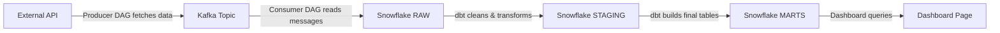

# Managing Data Sources: Add, Edit, Remove, or Replace

This guide explains how to work with data sources in the pipeline — from the API that provides the data, all the way through to the dashboard page that displays it. Every step includes the exact files to edit and code to write.

> **Who is this for?** Anyone adding a new data source, modifying an existing one, or removing one they no longer need. You don't need to be an expert — the guide walks through every layer with concrete examples.

---

## Table of Contents

- [1. How the Pipeline Works (Quick Refresher)](#1-how-the-pipeline-works-quick-refresher)
- [2. Adding a New Data Source](#2-adding-a-new-data-source)
  - [Step 1: Design Decisions](#step-1-design-decisions)
  - [Step 2: API Client](#step-2-api-client)
  - [Step 3: Register Kafka Topic and Consumer Group](#step-3-register-kafka-topic-and-consumer-group)
  - [Step 4: Register Snowflake Table Names](#step-4-register-snowflake-table-names)
  - [Step 5: Create the Producer DAG](#step-5-create-the-producer-dag)
  - [Step 6: Create the Consumer DAG](#step-6-create-the-consumer-dag)
  - [Step 7: Create dbt Models](#step-7-create-dbt-models)
  - [Step 8: Create the Kafka Topic in the Deploy Script](#step-8-create-the-kafka-topic-in-the-deploy-script)
  - [Step 9: Build the Dashboard](#step-9-build-the-dashboard)
  - [Step 10: Deploy and Verify](#step-10-deploy-and-verify)
- [3. Editing an Existing Data Source](#3-editing-an-existing-data-source)
- [4. Removing a Data Source](#4-removing-a-data-source)
- [5. Replacing a Data Source](#5-replacing-a-data-source)
- [6. File Map (Quick Reference)](#6-file-map-quick-reference)
- [7. Troubleshooting](#7-troubleshooting)

---

## 1. How the Pipeline Works (Quick Refresher)

Every data source in this project follows the same six-layer flow. Data starts at an external API and ends up on a live dashboard:



**What each layer does:**

| Layer | Tool | What Happens |
|-------|------|-------------|
| **External API** | Python (`requests`) | The producer DAG calls the API and downloads raw data |
| **Kafka** | Apache Kafka | Data is published as a message to a topic, then consumed by the next DAG |
| **Snowflake RAW** | Snowflake | Raw data is inserted into a landing table — no transformations yet |
| **Snowflake STAGING** | dbt (views) | Light cleanup: cast types, rename columns, filter bad rows |
| **Snowflake MARTS** | dbt (tables) | Final curated tables: deduplicated, business logic applied, ready for dashboards |
| **Dashboard** | Flask + Dash + Plotly | Interactive web page with charts, tables, and dropdowns |

### Where the existing sources live (file map)

This table shows exactly where each existing data source touches the codebase. When adding a new source, you'll create similar files in each row:

| Layer | Stocks (SEC EDGAR) | Weather (Open-Meteo) |
|-------|-------------------|---------------------|
| API client | `airflow/dags/edgar_client.py` | `airflow/dags/weather_client.py` |
| Producer DAG | `airflow/dags/dag_stocks.py` | `airflow/dags/dag_weather.py` |
| Kafka topic | `stocks-financials-raw` | `weather-hourly-raw` |
| Consumer DAG | `airflow/dags/dag_stocks_consumer.py` | `airflow/dags/dag_weather_consumer.py` |
| Snowflake RAW table | `PIPELINE_DB.RAW.COMPANY_FINANCIALS` | `PIPELINE_DB.RAW.WEATHER_HOURLY` |
| dbt staging model | `airflow/dags/dbt/models/staging/stg_company_financials.sql` | `airflow/dags/dbt/models/staging/stg_weather_hourly.sql` |
| dbt mart model | `airflow/dags/dbt/models/marts/fct_company_financials.sql` | `airflow/dags/dbt/models/marts/fct_weather_hourly.sql` |
| dbt source declaration | `airflow/dags/dbt/models/sources.yml` | same file |
| dbt tests | `airflow/dags/dbt/models/schema.yml` | same file |
| Kafka topic creation | `scripts/deploy/kafka.sh` | same file |
| Config (Kafka topics) | `airflow/dags/shared/config.py` | same file |
| Config (table names) | `airflow/dags/shared/snowflake_schema.py` | same file |
| Dashboard queries | `dashboard/db.py` | same file |
| Dashboard charts | `dashboard/charts.py` | `dashboard/weather_charts.py` |
| Dashboard callbacks | `dashboard/callbacks.py` | same file |
| Dashboard layout | `dashboard/app.py` (stocks Dash app) | `dashboard/app.py` (weather Dash app) |
| Dashboard security | `dashboard/security.py` (`ALLOWED_TICKERS`) | `dashboard/security.py` (`ALLOWED_CITIES`) |

---

## 2. Adding a New Data Source

This walkthrough uses a **"crypto prices"** example (fetching daily prices from CoinGecko's free API) to show every step. Replace the names and API details with your actual data source.

### Step 1: Design Decisions

Before writing any code, decide these five things:

| Decision | What It Means | Crypto Example |
|----------|--------------|----------------|
| **Schedule** | How often should the DAG run? Match the API's update frequency. | `timedelta(hours=24)` — CoinGecko updates daily |
| **Write strategy** | Does the API return *all* historical data (use overwrite) or only *new* data (use append with dedup)? | Append with dedup — each call returns the latest price |
| **Kafka topic name** | Use lowercase with hyphens. Format: `<source>-<description>-raw` | `crypto-prices-raw` |
| **Snowflake table name** | Uppercase, goes in the RAW schema. | `CRYPTO_PRICES` |
| **dbt tag** | Lowercase, used to run only this source's models. | `crypto` |

### Step 2: API Client

**Create a new file:** `airflow/dags/crypto_client.py`

This file is responsible for calling the external API and returning raw data. Keep it focused — one function, one job.

```python
"""API client for CoinGecko — fetches daily crypto prices."""
import requests  # HTTP library for calling external APIs


def fetch_crypto_prices(coin_ids: list[str]) -> list[dict]:
    """Call CoinGecko and return a list of price records — one per coin."""
    url = "https://api.coingecko.com/api/v3/simple/price"  # free endpoint, no API key needed
    params = {
        "ids": ",".join(coin_ids),      # comma-separated list of coin IDs (e.g. "bitcoin,ethereum")
        "vs_currencies": "usd",         # price denominated in US dollars
        "include_24hr_change": "true",   # include the 24-hour price change percentage
    }
    resp = requests.get(url, params=params, timeout=10)  # 10s timeout prevents hanging on slow networks
    resp.raise_for_status()  # raise an exception if the API returns an error (4xx/5xx)
    return resp.json()  # return the parsed JSON response as a Python dict
```

**Pattern to follow:** Look at `airflow/dags/weather_client.py` for a real example.

### Step 3: Register Kafka Topic and Consumer Group

**Edit:** `airflow/dags/shared/config.py`

Add two constants at the bottom of the Kafka section. This is the single place where topic names are defined — every other file imports from here.

```python
# ── Kafka (add these lines to the existing Kafka section) ─────────────────────
KAFKA_CRYPTO_TOPIC  = "crypto-prices-raw"      # topic written by dag_crypto.py, read by dag_crypto_consumer.py
KAFKA_CRYPTO_GROUP  = "crypto-consumer-group"   # consumer group for crypto pipeline (offsets tracked per group)
```

### Step 4: Register Snowflake Table Names

**Edit:** `airflow/dags/shared/snowflake_schema.py`

Add fully-qualified table identifiers. This prevents hardcoded table names from appearing in multiple files.

```python
# ── Add these lines to the existing table identifiers section ─────────────────
RAW_CRYPTO_PRICES    = f"{PIPELINE_DB}.{RAW_SCHEMA}.CRYPTO_PRICES"         # raw rows from CoinGecko API
MARTS_FCT_CRYPTO     = f"{PIPELINE_DB}.{MARTS_SCHEMA}.FCT_CRYPTO_PRICES"   # dbt-built daily crypto mart
```

### Step 5: Create the Producer DAG

**Create a new file:** `airflow/dags/dag_crypto.py`

The producer DAG fetches data from the API, transforms it, publishes to Kafka, and triggers the consumer DAG. Follow the existing pattern in `airflow/dags/dag_weather.py`.

```python
import json
from typing import Any
from datetime import datetime, timedelta

import pendulum
from airflow.sdk import dag, task, XComArg, get_current_context, Variable
from airflow.providers.standard.operators.trigger_dagrun import TriggerDagRunOperator

from crypto_client import fetch_crypto_prices  # our new API client from Step 2
from file_logger import OutputTextWriter
from shared.utils import get_writer, log_df_preview  # shared logging helpers
from dag_utils import check_vacation_mode  # skips task if VACATION_MODE is enabled
from alerting import on_failure_alert, on_retry_alert, on_success_alert  # Slack alerts on failure/retry


@dag(
    "API_Crypto-Pull_Data",
    default_args={
        "depends_on_past": False,
        "retries": 1,
        "retry_delay": timedelta(minutes=5),
        "execution_timeout": timedelta(minutes=10),  # kill task if it runs longer than 10 minutes
        "on_failure_callback": on_failure_alert,      # send Slack alert on failure
        "on_success_callback": on_success_alert,      # send Slack recovery message on success
        "on_retry_callback": on_retry_alert,          # send Slack alert on retry
    },
    description="Crypto pipeline: CoinGecko → Kafka (consumer DAG writes Snowflake → dbt)",
    schedule=timedelta(hours=24),  # daily — matches CoinGecko's free-tier update frequency
    start_date=pendulum.datetime(2025, 6, 8, 0, 0, tz="America/New_York"),  # fixed past date
    catchup=False,  # don't backfill historical runs — we only want current prices
    tags=["learning", "crypto", "external api pull"],
)
def crypto_pipeline():
    """Crypto price pipeline: CoinGecko → Kafka → Snowflake RAW → dbt → Dashboard."""

    # List of coins to track — add or remove coins here
    COINS = ["bitcoin", "ethereum", "solana"]

    @task()
    def extract() -> dict:
        """Fetch latest prices from CoinGecko for all tracked coins."""
        check_vacation_mode()  # skip if vacation mode is active
        raw_data = fetch_crypto_prices(COINS)  # call the API client from Step 2
        return raw_data  # returns e.g. {"bitcoin": {"usd": 65000, "usd_24h_change": 2.1}, ...}

    @task()
    def transform(raw_data: dict) -> list[dict[str, Any]]:
        """Flatten API response into a list of records suitable for Snowflake."""
        import pandas as pd  # deferred import — avoids slow pandas load during DAG parse
        writer: OutputTextWriter = get_writer()  # shared logging helper

        records = []
        for coin_id, prices in raw_data.items():
            records.append({
                "coin_id": coin_id,                                       # e.g. "bitcoin"
                "price_usd": prices.get("usd"),                           # current price in USD
                "change_24h_pct": prices.get("usd_24h_change"),           # 24-hour change percentage
                "fetched_at": datetime.now().isoformat(),                  # when this record was fetched
            })

        df = pd.DataFrame(records)
        log_df_preview(writer, df)  # log first 5 rows + dtypes for debugging
        return df.to_dict(orient="records")  # convert to list-of-dicts for XCom serialization

    @task()
    def publish_to_kafka(records: list[dict[str, Any]]) -> int:
        """Publish transformed records to the crypto Kafka topic."""
        from kafka_client import make_producer  # shared Kafka producer factory
        from shared.config import KAFKA_CRYPTO_TOPIC  # topic name from config.py

        writer: OutputTextWriter = get_writer()
        context = get_current_context()

        producer = make_producer()  # creates producer with broker address from Airflow Variable
        producer.send(
            KAFKA_CRYPTO_TOPIC,
            key=context["run_id"].encode("utf-8"),  # idempotency key — prevents duplicate processing
            value=records,                           # full batch as one JSON payload
        )
        producer.flush()   # block until the broker confirms receipt
        producer.close()

        writer.log(f"Published {len(records)} records to {KAFKA_CRYPTO_TOPIC}")
        return len(records)

    # Wire the pipeline: extract → transform → publish → trigger consumer
    raw_data       : XComArg = extract()
    records        : XComArg = transform(raw_data)
    publish_result           = publish_to_kafka(records)

    # Fire the consumer DAG after publishing — consumer handles Snowflake write + dbt
    trigger_consumer = TriggerDagRunOperator(
        task_id="trigger_consumer",
        trigger_dag_id="crypto_consumer_pipeline",  # must match the consumer DAG's dag_id
        wait_for_completion=False,                   # fire-and-forget — consumer has its own retries
    )
    publish_result >> trigger_consumer

dag = crypto_pipeline()  # module-level variable — required for Airflow DAG discovery
```

**Key patterns used:**
- `check_vacation_mode()` — skips the DAG if you've enabled vacation mode
- `get_writer()` — structured logging to the Kubernetes PVC
- `make_producer()` — shared Kafka factory (never construct a producer manually)
- `TriggerDagRunOperator` — fires the consumer DAG after publishing

### Step 6: Create the Consumer DAG

**Create a new file:** `airflow/dags/dag_crypto_consumer.py`

The consumer DAG reads from Kafka, writes to Snowflake RAW, and runs dbt to build STAGING + MARTS tables. Follow the pattern in `airflow/dags/dag_weather_consumer.py`.

```python
import json
from typing import Any
from datetime import timedelta, date

import pendulum
from airflow.sdk import dag, task, XComArg, Variable
from airflow.providers.standard.operators.python import ShortCircuitOperator
from shared.dbt_utils import make_dbt_operator  # shared factory for dbt run/test BashOperators

from file_logger import OutputTextWriter
from shared.utils import get_writer, log_df_preview
from shared.gate_utils import _has_new_rows  # returns True if row_count > 0 — gates dbt
from alerting import on_failure_alert, on_retry_alert, on_success_alert


@dag(
    "crypto_consumer_pipeline",
    default_args={
        "depends_on_past": False,
        "retries": 1,
        "retry_delay": timedelta(minutes=5),
        "execution_timeout": timedelta(minutes=20),  # covers consume + write + dbt run + dbt test
        "on_failure_callback": on_failure_alert,
        "on_success_callback": on_success_alert,
        "on_retry_callback": on_retry_alert,
    },
    description="Crypto consumer: reads Kafka → writes Snowflake CRYPTO_PRICES → dbt",
    schedule=None,  # triggered by dag_crypto.py — not scheduled on a timer
    start_date=pendulum.datetime(2025, 6, 8, 0, 0, tz="America/New_York"),
    catchup=False,
    tags=["crypto", "kafka", "consumer", "snowflake", "learning"],
)
def crypto_consumer_pipeline():
    """Triggered by dag_crypto.py. Reads Kafka → writes Snowflake → runs dbt."""

    @task()
    def consume_from_kafka() -> list[dict[str, Any]]:
        """Read the latest batch of crypto prices from the Kafka topic."""
        from kafka_client import make_consumer  # shared Kafka consumer factory
        from shared.config import KAFKA_CRYPTO_TOPIC, KAFKA_CRYPTO_GROUP  # topic/group from config.py

        writer: OutputTextWriter = get_writer()
        consumer = make_consumer(KAFKA_CRYPTO_TOPIC, KAFKA_CRYPTO_GROUP)  # subscribes to our topic

        records: list[dict[str, Any]] = []
        for msg in consumer:
            records.extend(msg.value)  # msg.value is the list-of-dicts published by the producer
            consumer.commit()          # advance the offset bookmark after reading
            writer.log(f"Consumed message offset={msg.offset}, partition={msg.partition}")

        consumer.close()
        writer.log(f"consume_from_kafka: {len(records)} records received")
        return records

    @task()
    def write_to_snowflake(records: list[dict[str, Any]]) -> int:
        """Write crypto records to Snowflake RAW, gated to once per day."""
        import pandas as pd  # deferred import — avoids slow load during DAG parse

        writer: OutputTextWriter = get_writer()

        if not records:
            writer.log("No records received — skipping Snowflake write")
            return 0

        # Daily batch gate: only write once per calendar day (saves Snowflake credits)
        today_iso = date.today().isoformat()
        last_write = Variable.get("SF_CRYPTO_LAST_WRITE_DATE", default="")

        if last_write == today_iso:
            writer.log(f"Already wrote today ({today_iso}) — skipping")
            return 0

        from snowflake_client import write_df_to_snowflake  # shared Snowflake write helper

        df = pd.DataFrame(records)
        log_df_preview(writer, df)  # log shape + dtypes for debugging

        # Append-only write — dedup handled by dbt mart's ROW_NUMBER() window function
        write_df_to_snowflake(df, "CRYPTO_PRICES", overwrite=False)
        writer.log(f"Wrote {len(df)} rows to Snowflake CRYPTO_PRICES")

        # Advance gate variable so we don't write again today
        Variable.set("SF_CRYPTO_LAST_WRITE_DATE", today_iso)
        return len(df)

    # Wire the pipeline: consume → write → gate → dbt run → dbt test
    records   : XComArg = consume_from_kafka()
    row_count : XComArg = write_to_snowflake(records)

    # Gate: skip dbt if no new rows were written (saves dbt + warehouse costs)
    check_new_rows = ShortCircuitOperator(
        task_id="check_new_rows",
        python_callable=_has_new_rows,  # returns True if row_count > 0
        op_args=[row_count],
    )

    # dbt run: builds staging views + mart tables tagged with "crypto"
    dbt_run = make_dbt_operator("dbt_run", "run", "crypto")

    # dbt test: validates data quality (not_null, accepted_values, etc.)
    dbt_test = make_dbt_operator("dbt_test", "test", "crypto")

    check_new_rows >> dbt_run >> dbt_test  # dbt only runs if new rows exist

dag = crypto_consumer_pipeline()
```

**Key patterns used:**
- `schedule=None` — the consumer is triggered by the producer, not by a timer
- `_has_new_rows()` via `ShortCircuitOperator` — skips dbt if nothing was written
- `make_dbt_operator()` — shared factory that builds the `dbt run`/`dbt test` commands with the right tag
- Daily batch gate via `Variable.get/set` — prevents duplicate writes within a day

### Step 7: Create dbt Models

dbt transforms raw data into clean, dashboard-ready tables. You need four changes:

#### 7a: Declare the source

**Edit:** `airflow/dags/dbt/models/sources.yml`

Add your new RAW table under the existing `tables:` list:

```yaml
      # Add this entry under the existing tables list
      - name: CRYPTO_PRICES
        description: "Raw CoinGecko daily crypto prices — append-only from dag_crypto_consumer.py"
```

The full file should look like this after the change:

```yaml
version: 2

sources:
  - name: raw
    database: PIPELINE_DB
    schema: RAW
    tables:
      - name: COMPANY_FINANCIALS
        description: "Raw SEC EDGAR XBRL financials — full table replace on each dag_stocks.py run"
      - name: WEATHER_HOURLY
        description: "Raw Open-Meteo hourly forecasts — append-only with dedup in dag_weather.py"
      - name: CRYPTO_PRICES
        description: "Raw CoinGecko daily crypto prices — append-only from dag_crypto_consumer.py"
```

#### 7b: Create the staging model

**Create a new file:** `airflow/dags/dbt/models/staging/stg_crypto_prices.sql`

The staging model is a lightweight view that casts types and filters bad rows. It does not store any data — it's a SQL view that reads from the RAW table on demand.

```sql
-- Staging view for CoinGecko crypto prices — casts types, filters nulls
-- tag:crypto ensures `dbt run --select tag:crypto` picks up this model
{{
    config(
        materialized='view',
        tags=['crypto']
    )
}}

select
    coin_id,                                          -- coin identifier (e.g. "bitcoin")
    try_cast(price_usd as float)       as price_usd,  -- safe cast: returns NULL instead of error on bad values
    try_cast(change_24h_pct as float)  as change_24h_pct,  -- 24-hour price change percentage
    try_to_timestamp(fetched_at)       as fetched_at   -- convert ISO string to TIMESTAMP_NTZ
from {{ source('raw', 'CRYPTO_PRICES') }}  -- resolves to PIPELINE_DB.RAW.CRYPTO_PRICES
where coin_id is not null       -- drop rows missing the coin identifier
  and price_usd is not null     -- drop rows missing the price
```

**Pattern to follow:** Look at `airflow/dags/dbt/models/staging/stg_weather_hourly.sql` for a real example.

#### 7c: Create the mart model

**Create a new file:** `airflow/dags/dbt/models/marts/fct_crypto_prices.sql`

The mart model is a physical table that deduplicates data and applies business logic. This is what the dashboard queries.

```sql
-- Fact table for crypto prices — dashboard-ready, deduplicated
-- tag:crypto — dag_crypto_consumer.py runs `dbt run --select tag:crypto` after each write
{{
    config(
        materialized='table',
        tags=['crypto']
    )
}}

with deduplicated as (
    select
        *,
        -- Keep only the most recently fetched price per coin per day
        row_number() over (
            partition by coin_id, fetched_at::date  -- one row per coin per calendar day
            order by fetched_at desc nulls last      -- most recent fetch wins
        ) as rn
    from {{ ref('stg_crypto_prices') }}  -- reads from the staging view
)

select
    coin_id,
    price_usd,
    change_24h_pct,
    fetched_at
from deduplicated
where rn = 1  -- drop duplicate rows — keep only the latest fetch per coin per day
```

**Pattern to follow:** Look at `airflow/dags/dbt/models/marts/fct_weather_hourly.sql` for a real example.

#### 7d: Add tests

**Edit:** `airflow/dags/dbt/models/schema.yml`

Add test definitions for both the staging and mart models. These tests run automatically after `dbt test --select tag:crypto` in the consumer DAG.

```yaml
  # Add these entries at the bottom of the existing models list

  - name: stg_crypto_prices
    config:
      tags: ['crypto']  # matches the tag in the SQL config block
    description: "Staged crypto prices — types cast, nulls filtered"
    columns:
      - name: coin_id
        data_tests:
          - not_null
          - accepted_values:
              values: ['bitcoin', 'ethereum', 'solana']  # must match COINS list in dag_crypto.py
      - name: price_usd
        data_tests: [not_null]
      - name: fetched_at
        data_tests: [not_null]

  - name: fct_crypto_prices
    config:
      tags: ['crypto']
    description: "Dashboard-ready crypto prices — deduplicated, one row per coin per day"
    columns:
      - name: coin_id
        data_tests: [not_null]
      - name: price_usd
        data_tests: [not_null]
      - name: fetched_at
        data_tests: [not_null]
```

### Step 8: Create the Kafka Topic in the Deploy Script

**Edit:** `scripts/deploy/kafka.sh`

Add a topic creation command inside the `step_deploy_kafka()` function, after the existing topic creation blocks:

```bash
        # Create crypto topic — add this after the weather topic creation block
        kubectl exec kafka-0 -n kafka -- /opt/kafka/bin/kafka-topics.sh \
            --bootstrap-server localhost:9092 --create --if-not-exists \
            --topic crypto-prices-raw --partitions 1 --replication-factor 1 \
        && echo 'Topic crypto-prices-raw ready.'
```

The `--if-not-exists` flag makes this safe to run every deploy — it skips creation if the topic already exists.

### Step 9: Build the Dashboard

The dashboard has five parts to wire up: queries, charts, callbacks, layout, and security.

#### 9a: Database queries

**Edit:** `dashboard/db.py`

Add a table constant, a query function, and add it to the cache prewarm:

```python
# Add this constant near the existing _TBL_FINANCIALS and _TBL_WEATHER lines
_TBL_CRYPTO = "PIPELINE_DB.MARTS.FCT_CRYPTO_PRICES"  # daily crypto prices mart

# Add this column list for the empty-DataFrame guard
CRYPTO_COLUMNS = ["coin_id", "price_usd", "change_24h_pct", "fetched_at"]


def load_crypto_data() -> pd.DataFrame:
    """Return the latest crypto prices from FCT_CRYPTO_PRICES; empty DataFrame if unavailable."""
    def _query():
        # Fetch all coins — dashboard dropdown filters client-side (same pattern as weather cities)
        query = text(f"""
            SELECT coin_id, price_usd, change_24h_pct, fetched_at
            FROM {_TBL_CRYPTO}
            ORDER BY coin_id, fetched_at DESC
        """)
        try:
            with DB_ENGINE.connect() as conn:
                return pd.read_sql(query, conn)  # load all rows into a DataFrame
        except Exception:
            return pd.DataFrame(columns=CRYPTO_COLUMNS)  # table may not exist yet

    return _cached_query("crypto", CACHE_TTL_FINANCIALS, CRYPTO_COLUMNS, _query)  # 1-hour cache
```

Then add it to `prewarm_cache()` inside the `ThreadPoolExecutor` block:

```python
        # Add this line alongside the existing prewarm futures
        futs += [pool.submit(_safe, load_crypto_data, "crypto")]
```

And add a health loader (follow the `load_weather_health()` pattern):

```python
def load_crypto_health() -> pd.DataFrame:
    """Return pipeline health for the crypto table."""
    def _query():
        query = text(f"""
            SELECT 'Crypto' AS table_name, COUNT(*) AS row_count, MAX(fetched_at) AS latest_ts
            FROM {_TBL_CRYPTO}
        """)
        try:
            with DB_ENGINE.connect() as conn:
                return pd.read_sql(query, conn)
        except Exception:
            return pd.DataFrame(columns=HEALTH_COLUMNS)

    return _cached_query("crypto_health", CACHE_TTL_FINANCIALS, HEALTH_COLUMNS, _query)
```

#### 9b: Charts

**Create a new file:** `dashboard/crypto_charts.py`

Follow the pattern in `dashboard/weather_charts.py` — one function per chart:

```python
"""Chart builders for the crypto dashboard page."""
import pandas as pd
import plotly.graph_objects as go
from dash import html

from theme import CHART_THEME as _CHART_THEME  # shared dark theme for all charts
from chart_utils import make_empty_figure  # themed empty figure for when data hasn't loaded yet


def build_crypto_price_fig(df: pd.DataFrame, coin: str = "") -> go.Figure:
    """Line chart of daily crypto price over time."""
    if df.empty:
        return make_empty_figure("No crypto data yet")  # guard: show placeholder if pipeline hasn't run

    fig = go.Figure(data=[go.Scatter(
        x=df["fetched_at"],       # daily timestamps on the x-axis
        y=df["price_usd"],        # price in USD on the y-axis
        mode="lines+markers",     # line with dots at each data point
        name="Price (USD)",
        line={"color": "#f59e0b", "width": 2.5},  # amber — distinct from stocks blue and weather blue
        hovertemplate="%{x}<br>$%{y:,.2f}<extra></extra>",  # tooltip: date + formatted price
    )])
    fig.update_layout(
        **_CHART_THEME,  # apply the shared dark theme
        title=f"{coin.title()} — Daily Price (USD)" if coin else "Daily Crypto Price (USD)",
        xaxis_title="Date",
        yaxis_title="Price (USD)",
        hovermode="x unified",  # show all traces at the same x position on hover
    )
    return fig


def build_crypto_stats_table(df: pd.DataFrame):
    """Summary stats: latest price, 24h change, and data freshness."""
    if df.empty:
        return html.P("No crypto data yet — run the pipeline to generate results.")

    latest = df.iloc[0]  # first row is most recent (query orders by fetched_at DESC)
    return html.Table(className="dash-table", children=[
        html.Thead(html.Tr([
            html.Th("Coin"), html.Th("Price (USD)"), html.Th("24h Change"), html.Th("Last Updated"),
        ])),
        html.Tbody(html.Tr([
            html.Td(latest["coin_id"].title()),
            html.Td(f"${latest['price_usd']:,.2f}"),
            html.Td(f"{latest['change_24h_pct']:.2f}%"),
            html.Td(str(latest["fetched_at"])),
        ])),
    ])
```

#### 9c: Callbacks

**Edit:** `dashboard/callbacks.py`

Add a `register_crypto_callbacks()` function. This wires up the interactivity — when a user picks a coin from the dropdown, the charts update:

```python
# Add these imports at the top of the file
from db import load_crypto_data, load_crypto_health
from crypto_charts import build_crypto_price_fig, build_crypto_stats_table


def register_crypto_callbacks(dash_app) -> None:
    """Register callbacks for the crypto dashboard page."""

    @dash_app.callback(
        Output("crypto-price-chart", "figure"),       # updates the price line chart
        Output("crypto-stats-table", "children"),      # updates the stats table
        Input("coin-dropdown", "value"),               # triggers when user picks a different coin
    )
    def update_crypto(coin: str):
        """Re-render charts when the user selects a different coin."""
        from security import ALLOWED_COINS  # import here to avoid circular import
        if coin not in ALLOWED_COINS:
            empty_fig = go.Figure()
            empty_fig.add_annotation(text="Invalid coin", showarrow=False, font={"size": 14})
            return empty_fig, html.P("Invalid coin selection.", style={"color": "red"})

        df = load_crypto_data()  # cached query — hits Snowflake at most once per hour
        coin_df = df[df["coin_id"] == coin]  # filter to selected coin
        return build_crypto_price_fig(coin_df, coin), build_crypto_stats_table(coin_df)

    @dash_app.callback(
        Output("crypto-health-table", "children"),
        Input("coin-dropdown", "value"),  # refresh health when coin changes
    )
    def update_crypto_health(_coin: str):
        """Render the pipeline health panel for crypto data."""
        health_df = load_crypto_health()
        return build_health_table(health_df)  # reuse the shared health table builder from charts.py
```

#### 9d: Layout (mount the Dash app)

**Edit:** `dashboard/app.py`

Add a new Dash app instance mounted at `/crypto/`. Place this after the weather Dash app section:

```python
# ── Crypto Dashboard — third Dash app mounted on the same Flask server ──────
from callbacks import register_crypto_callbacks
from security import ALLOWED_COINS  # allowlist for the coin dropdown

crypto_dash_app = dash.Dash(
    __name__,
    server=app,                     # share the same Flask instance
    url_base_pathname="/crypto/",   # crypto page lives at /crypto/
)

crypto_dash_app.layout = html.Div(
    className="dash-page",
    children=[
        *build_spot_layout_components("crypto"),     # spot interruption banner
        *build_offline_layout_components("crypto"),   # offline detection banner

        html.H1("Crypto Analytics Pipeline"),
        html.P(
            "CoinGecko daily crypto prices ingested via Airflow → Kafka → Snowflake.",
            className="dash-subtitle",
        ),

        # Navigation links to other dashboards
        html.Div(className="dash-nav", children=[
            html.A("← Stocks Dashboard", href="/dashboard/", className="dash-nav__link"),
            html.A("Weather Dashboard →", href="/weather/", className="dash-nav__link"),
        ]),

        # Coin selector dropdown
        html.Label("Select Coin:"),
        dcc.Dropdown(
            id="coin-dropdown",
            options=[{"label": c.title(), "value": c} for c in sorted(ALLOWED_COINS)],
            value="bitcoin",        # default selection
            clearable=False,
            style={"width": "250px", "marginBottom": "20px"},
        ),

        # Charts and stats — wrapped in a loading spinner
        dcc.Loading(
            id="loading-crypto",
            type="circle",
            children=[
                dcc.Graph(id="crypto-price-chart"),   # price line chart
                html.Div(id="crypto-stats-table"),     # summary stats table
            ],
        ),

        # Pipeline health panel
        html.Hr(),
        html.H2("Pipeline Health"),
        dcc.Loading(
            id="loading-crypto-health",
            type="circle",
            children=[html.Div(id="crypto-health-table")],
        ),
    ],
)

register_crypto_callbacks(crypto_dash_app)
register_spot_callbacks(crypto_dash_app, "crypto")
register_offline_callbacks(crypto_dash_app, "crypto")
```

Also add navigation links from the existing stocks and weather pages so users can find the new page. In the stocks layout, add a link to `/crypto/`; in the weather layout, add a link to `/crypto/`.

#### 9e: Security allowlist

**Edit:** `dashboard/security.py`

Add an allowlist for the new dropdown values:

```python
# Add this near the existing ALLOWED_TICKERS and ALLOWED_CITIES
ALLOWED_COINS: frozenset = frozenset({"bitcoin", "ethereum", "solana"})  # must match COINS in dag_crypto.py
```

#### 9f: Cache prewarm

In `dashboard/db.py`, ensure `load_crypto_data` and `load_crypto_health` are called in `prewarm_cache()` (covered in Step 9a).

### Step 10: Deploy and Verify

Deploy everything by running:

```bash
./scripts/deploy.sh
```

> **Tip:** If you only changed DAG files (not dashboard code), use `./scripts/deploy.sh --dags-only` for a faster deploy (~5 min instead of ~20 min).

**Verification checklist:**

- [ ] Kafka topic exists: `kubectl exec kafka-0 -n kafka -- /opt/kafka/bin/kafka-topics.sh --list --bootstrap-server localhost:9092` — you should see `crypto-prices-raw`
- [ ] Producer DAG visible in the Airflow UI under "API_Crypto-Pull_Data"
- [ ] Trigger a manual run of the producer DAG
- [ ] Consumer DAG ("crypto_consumer_pipeline") fires automatically after the producer finishes
- [ ] Data appears in Snowflake: `SELECT * FROM PIPELINE_DB.RAW.CRYPTO_PRICES LIMIT 5;`
- [ ] dbt run succeeds: check the consumer DAG's `dbt_run` task logs
- [ ] dbt test passes: check the consumer DAG's `dbt_test` task logs
- [ ] Dashboard page loads at `/crypto/`
- [ ] Dropdown works and charts render with real data
- [ ] Navigation links from stocks and weather pages work

---

## 3. Editing an Existing Data Source

Editing means changing the behavior of a source that already works — a new API field, a different schedule, a new chart, etc.

Use this lookup table to find which files to edit for common changes:

| What You Want to Change | Files to Edit | See Also |
|------------------------|---------------|----------|
| **Add a new column from the API** | API client → producer DAG `transform()` → consumer DAG `write_to_snowflake()` (if type casting needed) → dbt staging view → dbt mart → `schema.yml` tests → `dashboard/db.py` query → chart builder | Steps 2, 5, 6, 7, 9a, 9b |
| **Change the DAG schedule** | Producer DAG (`schedule=` parameter in `@dag`) | Step 5 |
| **Add a new entity (ticker/city/coin)** | `shared/config.py` (if entity list is there) → `dashboard/security.py` (allowlist) → `dashboard/app.py` (dropdown options) → `schema.yml` (`accepted_values` test) | Steps 3, 7d, 9d, 9e |
| **Change the write strategy (overwrite ↔ append)** | Consumer DAG `write_to_snowflake()` — change `overwrite=True/False` | Step 6 |
| **Change a Kafka topic name** | `shared/config.py` → `scripts/deploy/kafka.sh` → delete the old topic on the cluster | Steps 3, 8 |
| **Rename a Snowflake table** | `shared/snowflake_schema.py` → `dbt/models/sources.yml` → dbt staging SQL → `dashboard/db.py` table constant | Steps 4, 7a, 7b, 9a |
| **Rename a dbt column** | Staging view SQL → mart SQL → `schema.yml` → `dashboard/db.py` query → chart builders | Steps 7b, 7c, 7d, 9a, 9b |
| **Add a new chart to an existing page** | Chart file (e.g. `charts.py` or `weather_charts.py`) → `callbacks.py` → `app.py` layout (add `dcc.Graph`) | Steps 9b, 9c, 9d |
| **Change the cache TTL** | `dashboard/config.py` — update the `CACHE_TTL_*` constant | Step 9a |
| **Add anomaly detection** | Follow the pattern in `airflow/dags/anomaly_detector.py` — runs as a subprocess with a separate virtual environment | See `dag_stocks_consumer.py` for how it's wired in |

---

## 4. Removing a Data Source

Removing means deleting a source entirely — it stops running, stops consuming resources, and disappears from the dashboard.

> **Warning:** Dropping Snowflake tables (last step) destroys historical data permanently. Consider keeping the RAW table as an archive even after removing everything else.

Work in reverse order — remove the visible surface first, then work backward to the data source:

- [ ] **Dashboard:** Remove the Dash app from `dashboard/app.py`, delete the charts file (e.g. `weather_charts.py`), remove callbacks from `dashboard/callbacks.py`, remove queries from `dashboard/db.py` (including the table constant, query function, health function, and prewarm entry), remove the allowlist from `dashboard/security.py`, remove navigation links from other pages
- [ ] **dbt tests:** Remove the model entries from `airflow/dags/dbt/models/schema.yml`; delete any singular tests in `airflow/dags/dbt/tests/`
- [ ] **dbt models:** Delete the staging view (e.g. `stg_weather_hourly.sql`) and mart table (e.g. `fct_weather_hourly.sql`)
- [ ] **dbt source:** Remove the table entry from `airflow/dags/dbt/models/sources.yml`
- [ ] **Consumer DAG:** Delete the file (e.g. `dag_weather_consumer.py`)
- [ ] **Producer DAG:** Delete the file (e.g. `dag_weather.py`) and the API client file (e.g. `weather_client.py`)
- [ ] **Config:** Remove Kafka topic/group constants from `airflow/dags/shared/config.py`; remove Snowflake table constants from `airflow/dags/shared/snowflake_schema.py`
- [ ] **Kafka topic:** Remove the creation command from `scripts/deploy/kafka.sh`; optionally delete the topic from the running cluster:
  ```bash
  kubectl exec kafka-0 -n kafka -- /opt/kafka/bin/kafka-topics.sh \
      --bootstrap-server localhost:9092 --delete --topic <topic-name>
  ```
- [ ] **Snowflake (optional, irreversible):**
  ```sql
  DROP TABLE IF EXISTS PIPELINE_DB.RAW.<TABLE_NAME>;
  DROP VIEW IF EXISTS PIPELINE_DB.STAGING.STG_<TABLE_NAME>;
  DROP TABLE IF EXISTS PIPELINE_DB.MARTS.FCT_<TABLE_NAME>;
  ```
- [ ] **Deploy:** Run `./scripts/deploy.sh` to sync all deletions to EC2

---

## 5. Replacing a Data Source

Replacing means swapping the API or data provider while keeping the pipeline structure intact.

### Scenario A: Same data shape, different API

Example: Swap Open-Meteo for Visual Crossing for weather data (both return hourly temperature).

Only two files need to change:

1. **API client file** (e.g. `weather_client.py`) — rewrite `fetch_weather_forecast()` to call the new API
2. **Producer DAG** `extract()` — update if the new API returns data in a different JSON structure

Everything downstream (Kafka, Snowflake, dbt, dashboard) stays the same because the data shape hasn't changed.

### Scenario B: Different data shape

Example: Replace SEC EDGAR with a fundamentally different financial API that returns different fields.

This is effectively **Remove old + Add new**. The safest approach:

1. **Add** the new source following [Section 2](#2-adding-a-new-data-source) — it runs alongside the old one
2. **Test** the new dashboard page with real data
3. **Remove** the old source following [Section 4](#4-removing-a-data-source) once the new one is confirmed working

> **Tip:** Running both sources in parallel during the transition means the old dashboard keeps working while you verify the new one. Never delete the old source before the new one is confirmed.

---

## 6. File Map (Quick Reference)

Every file involved in the pipeline, organized by layer:

### Airflow DAGs
| File | Purpose |
|------|---------|
| `airflow/dags/dag_stocks.py` | Stocks producer: SEC EDGAR → Kafka |
| `airflow/dags/dag_stocks_consumer.py` | Stocks consumer: Kafka → Snowflake → dbt → anomaly detection |
| `airflow/dags/dag_weather.py` | Weather producer: Open-Meteo → Kafka |
| `airflow/dags/dag_weather_consumer.py` | Weather consumer: Kafka → Snowflake → dbt |
| `airflow/dags/dag_staleness_check.py` | Manual trigger: checks if data is too old |
| `airflow/dags/anomaly_detector.py` | ML model: IsolationForest anomaly scoring (stocks only) |

### API Clients
| File | Purpose |
|------|---------|
| `airflow/dags/edgar_client.py` | SEC EDGAR API request functions |
| `airflow/dags/weather_client.py` | Open-Meteo API request function |

### Shared Utilities (reuse these — never duplicate)
| File | Purpose |
|------|---------|
| `airflow/dags/kafka_client.py` | `make_producer()` / `make_consumer()` — Kafka client factories |
| `airflow/dags/snowflake_client.py` | `write_df_to_snowflake()` — bulk DataFrame writer |
| `airflow/dags/shared/config.py` | Central config: Kafka topics, consumer groups, cities, thresholds |
| `airflow/dags/shared/snowflake_schema.py` | Fully-qualified Snowflake table/schema identifiers |
| `airflow/dags/shared/dbt_utils.py` | `make_dbt_operator()` — BashOperator factory for dbt |
| `airflow/dags/shared/gate_utils.py` | `_has_new_rows()` / `check_daily_gate()` — batch gate logic |
| `airflow/dags/shared/utils.py` | `get_writer()` / `log_df_preview()` — structured logging |
| `airflow/dags/dag_utils.py` | `check_vacation_mode()` — vacation mode guard |
| `airflow/dags/alerting/callbacks.py` | `on_failure_alert` / `on_success_alert` — Slack alerting |

### dbt (data transformation)
| File | Purpose |
|------|---------|
| `airflow/dags/dbt/dbt_project.yml` | dbt project config (materialization settings, schema mapping) |
| `airflow/dags/dbt/models/sources.yml` | Source declarations pointing at RAW tables |
| `airflow/dags/dbt/models/schema.yml` | Test definitions for all models |
| `airflow/dags/dbt/models/staging/stg_*.sql` | Staging views (one per source) |
| `airflow/dags/dbt/models/marts/fct_*.sql` | Mart tables (one per source) |
| `airflow/dags/dbt/tests/assert_*.sql` | Custom singular tests |
| `airflow/dags/dbt/macros/generate_schema_name.sql` | Schema name routing macro |

### Dashboard
| File | Purpose |
|------|---------|
| `dashboard/app.py` | Flask + Dash app: mounts all dashboard pages, builds layouts |
| `dashboard/db.py` | Snowflake queries with TTL caching + cache prewarm |
| `dashboard/callbacks.py` | Dash callbacks: wires dropdown/button inputs to chart/table outputs |
| `dashboard/charts.py` | Plotly chart builders for the stocks page |
| `dashboard/weather_charts.py` | Plotly chart builders for the weather page |
| `dashboard/chart_utils.py` | Shared chart helpers (`build_color_map`, `make_empty_figure`) |
| `dashboard/security.py` | Rate limiting, CSP headers, allowlists (`ALLOWED_TICKERS`, `ALLOWED_CITIES`) |
| `dashboard/config.py` | Environment variable loading (DB credentials, cache TTLs, secrets) |
| `dashboard/theme.py` | Shared Plotly dark theme (`CHART_THEME`) |
| `dashboard/routes.py` | Flask routes: `/health`, `/health/ready`, `/validation`, `/api/spot-status` |

### Deploy
| File | Purpose |
|------|---------|
| `scripts/deploy.sh` | Main deploy script — orchestrates all deploy modules |
| `scripts/deploy/kafka.sh` | Kafka manifest sync + topic creation |

---

## 7. Troubleshooting

### "My DAG doesn't appear in the Airflow UI"

**Cause:** An import error during DAG parsing. Airflow silently skips DAGs that fail to import.

**Fix:** Check for import errors:
```bash
# SSH into the scheduler pod and check for DAG import errors
kubectl exec -it <scheduler-pod> -n airflow-my-namespace -- airflow dags list-import-errors
```

Common causes: a typo in an import statement, a missing Python package, or an indentation error.

### "dbt test fails with `accepted_values`"

**Cause:** You added a new entity (e.g. a new ticker or coin) in the DAG code but forgot to add it to the `accepted_values` list in `schema.yml`.

**Fix:** Edit `airflow/dags/dbt/models/schema.yml` and add the new value to the `accepted_values` list for that column.

### "Kafka consumer times out with no messages"

**Cause:** The topic name in `shared/config.py` doesn't match the topic created in `scripts/deploy/kafka.sh`, or the topic hasn't been created yet.

**Fix:** Verify the topic exists:
```bash
kubectl exec kafka-0 -n kafka -- /opt/kafka/bin/kafka-topics.sh \
    --list --bootstrap-server localhost:9092
```
If the topic is missing, run `./scripts/deploy.sh` to create it.

### "Dashboard shows an empty chart"

**Cause:** The `DB_BACKEND` environment variable is not set to `snowflake`, or the dbt mart table hasn't been built yet.

**Fix:**
1. Check that `DB_BACKEND=snowflake` is set in the Flask pod's K8s secret
2. Run the producer DAG manually to trigger the full pipeline (API → Kafka → Snowflake → dbt)
3. Verify data exists: `SELECT COUNT(*) FROM PIPELINE_DB.MARTS.FCT_<YOUR_TABLE>;`

### "Deploy fails at Kafka topic creation"

**Cause:** The Kafka pod isn't ready yet — topic creation runs before Kafka finishes starting.

**Fix:** Re-run `./scripts/deploy.sh`. The deploy script waits up to 480 seconds for Kafka to start; if it times out, a second run usually succeeds because the pod is already warm.

### "Consumer DAG doesn't trigger after producer finishes"

**Cause:** The `trigger_dag_id` in the producer's `TriggerDagRunOperator` doesn't match the consumer DAG's `dag_id`.

**Fix:** Verify that the string in `trigger_dag_id="crypto_consumer_pipeline"` exactly matches the first argument to `@dag("crypto_consumer_pipeline", ...)` in the consumer file.
