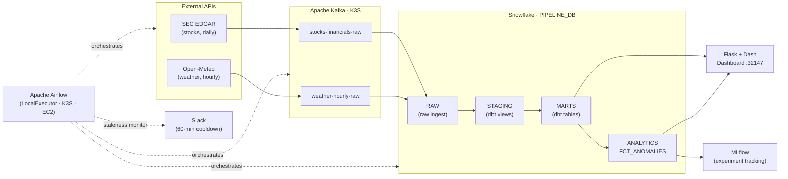

# Architecture Diagram

System overview of the data pipeline. See [README.md](../../README.md) for full context.

## Component Notes

| Component | Detail |
|-----------|--------|
| **Apache Airflow** | LocalExecutor on K3S; 5 DAGs (stocks producer/consumer, weather producer/consumer, staleness monitor) |
| **Apache Kafka 4.0** | KRaft mode (no ZooKeeper), plain StatefulSet; 2 topics, 48h/100MB retention each |
| **Snowflake** | PIPELINE_DB; RAW written by consumer DAGs; STAGING/MARTS built by dbt; FCT_ANOMALIES written by anomaly_detector.py |
| **Flask + Dash** | NodePort 32147; 1-hour query cache; pre-warmed at container startup |
| **MLflow** | Tracks every anomaly detection run — parameters, metrics, model artifact |
| **Slack** | Fired by staleness monitor DAG when either pipeline hasn't run recently; 60-min cooldown prevents alert floods |
